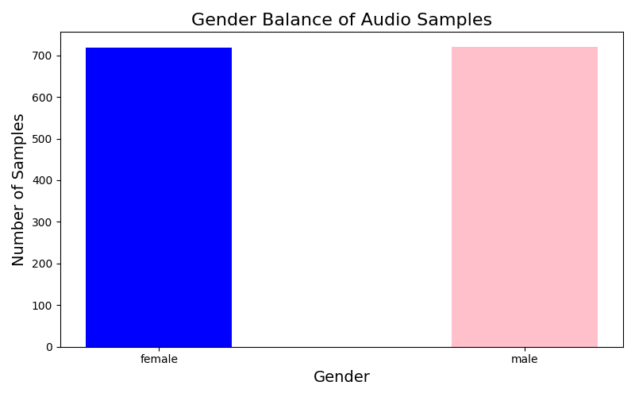
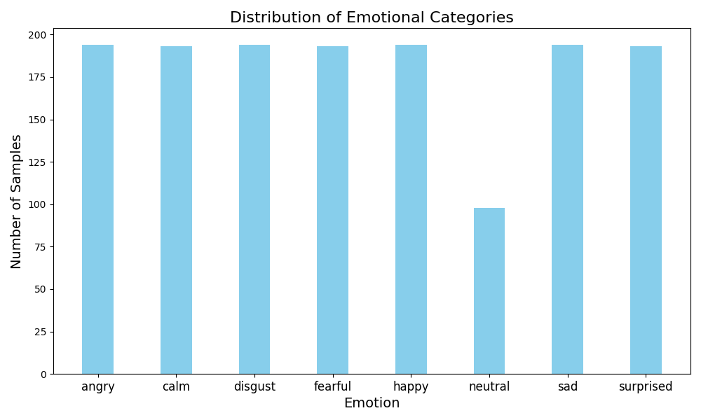
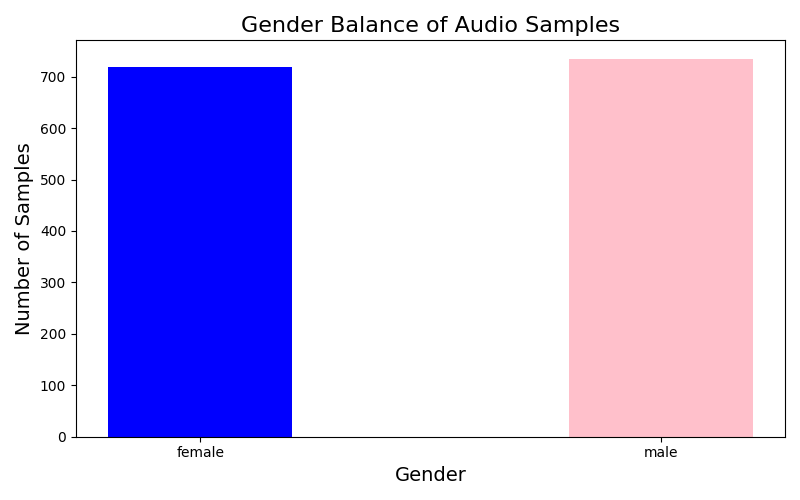

IAT 360: Exploring Artificial Intelligence 
Harjot Singh
October 2, 2024

Graph One (Emotional Balance without my audio):

Neutral: 94.8
Calm: 190.7
Happy: 190.3
Sad: 190.3
Angry: 190.5
Fearful: 190.7
Disgust: 190.3
Surprised: 189.9

Graph Two (Gender Balance without my audio):

Female: 714.7
Male: 714.8

Graph Three (Emotional Balance WITH my audio):

Neutral: 97.0
Calm: 190.8
Happy: 192.9
Sad: 192.3
Angry: 193.1
Fearful: 191.3
Disgust: 192.3
Surprised: 191.7

Graph Four (Gender Balance WITH my audio):

Female: 709.1
Male: 726.6

